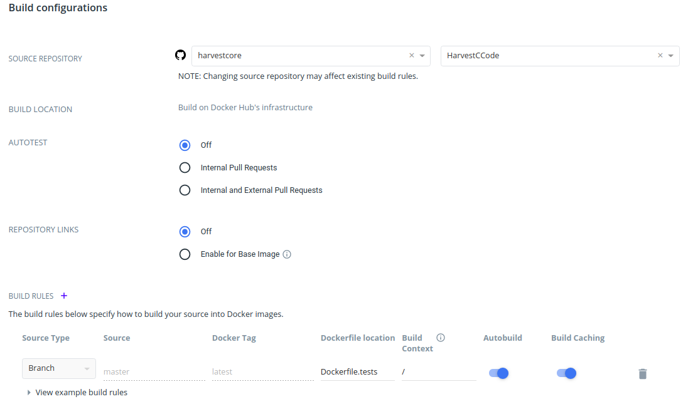

# Dockerfile.tests

> This document contains all the information related to the confection of the [`Dockerfile.tests`](../Dockerfile.tests) file used to create an image to run the unit tests of this project.

The content of the testing Dockerfile is the following:

```Dockerfile
FROM golang:1.15.5-alpine
LABEL maintainer="Ángel Gómez <agomezm@correo.ugr.es>"
LABEL version="0.1"

WORKDIR /go/src/github.com/harvestcore/HarvestCCode
ENV CGO_ENABLED 0

RUN apk update --no-cache; apk add --no-cache make git

CMD cp -R --symbolic-link /app/test/* /go/src/github.com/harvestcore/HarvestCCode; \
    make test
```

## Base image

The base image selected is [`golang:1.15.5-alpine`](https://github.com/docker-library/golang/blob/071e264f53e89ea75f1a38f6c1c33641685d8560/1.15/alpine3.12/Dockerfile). It is a lightweigh image that already includes Golang v1.15.5 installed, without any extra unnecesary software. Since I'm only going to run some unit tests in the container I don't need an image that includes extra software, like [`golang:1.15.5-buster`](https://github.com/docker-library/golang/blob/071e264f53e89ea75f1a38f6c1c33641685d8560/1.15/buster/Dockerfile) (based on Debian) or [`golang:1.15.5-windowsservercore-1809`](https://github.com/docker-library/golang/blob/071e264f53e89ea75f1a38f6c1c33641685d8560/1.15/windows/windowsservercore-1809/Dockerfile) (based on Windows).

On the other hand, having a base image with Golang already installed saves me some time when building the image.

## Dockerfile explanation

> In this section I'll explain each line of the Dockerfile. I've followed the best practices that [Docker](https://docs.docker.com/develop/develop-images/dockerfile_best-practices/) recommends.

```Dockerfile
FROM golang:1.15.5-alpine
```

Base image, explained above.

```Dockerfile
LABEL maintainer="Ángel Gómez <agomezm@correo.ugr.es>"
LABEL version="0.2"
```

Some labels, including the maintainer (me) and the version of the Dockerfile (0.2).

```Dockerfile
WORKDIR /go/src/github.com/harvestcore/HarvestCCode
```

`WORKDIR` sets the working directory in which all commands (like `RUN`, `CMD` or `COPY`) are executed. In my case I've set it to `/go/src/github.com/harvestcore/HarvestCCode` since `/go/src` is the usual directory in which all Golang projects are stored. `github.com/harvestcore/HarvestCCode` is also the name of the package of my project.

```Dockerfile
ENV CGO_ENABLED 0
```

Golang is able to run C code, and Golang by itself sometimes makes use of this ([`cgo` package](https://golang.org/cmd/cgo/)). Since I'm using an Alpine image which does not include the GCC compiler, it is possible to avoid this code execution by setting the environment variable `CGO_ENABLED` to `0`. By doing this I'm forcing a build using just Golang, not C code. This has no impact at all and allows me to save some bytes in the image size.

```Dockerfile
RUN apk update --no-cache; apk add --no-cache make git
```

Simple run command that updates the index of packages and after that installs Git (used by Golang to fetch the needed packages) and Make (since it is the task manager I'm using). I've added the `--no-cache` flag to avoid storing cache files when installing the needed packages (this also saves me some bytes).

```Dockerfile
CMD cp -R --symbolic-link /app/test/* /go/src/github.com/harvestcore/HarvestCCode; make test
```

This image will be tested using the command `docker run -t -v /some/path:/app/test nick-estudiante/nombre-del-repo` this means that a volume will be mounted in `/app/test` and all the project files will be there. The command `cp -R --symbolic-link /app/test/* /go/src/github.com/harvestcore/HarvestCCode` creates symbolic links recursively (from all the files and directories in `/app/test`) in the directory I've set as `WORKDIR`. The project files are not available in build time, so this command must be run in runtime. By creating symbolic links I can avoid copying the raw files into the desired directory. After that I just execute `make test`, which installs all the needed testing dependencies and runs the unit tests.

## DockerHub & GitHub Registry

First of all I've created a new repository in DockerHub ([this one](https://hub.docker.com/r/harvestcore/harvestccode)). After that I've configured the automated build as shown below:

- I've linked my GitHub account with DockerHub.
- I've set the build rules:
  - Branch: `master`
  - Dockerfile location: `Dockerfile.tests`
  - Autobuild: enabled
  - Build caching: enabled



This configuration works alright, but it will rebuild the image every time I push something in this repo. This makes no sense at all, since this image is static and it will barely be updated. For this reason I've created a GH Action workflow, that builds and pushes the testing image only when the Dockerfile.tests file is updated.

This is the [file](../Dockerfile.tests) content:

```yml
name: Publish testing Docker image

on:
  push:
    paths:
      - 'Dockerfile.tests'

jobs:
  push-to-registries:
    name: Push to registries
    runs-on: ubuntu-latest
    env:
      image-tag: harvestcore/harvestccode:latest
    steps:
    - name: Git checkout
      uses: actions/checkout@v2

    - name: Set up QEMU
      uses: docker/setup-qemu-action@v1

    - name: Set up Docker Buildx
      uses: docker/setup-buildx-action@v1

    - name: DockerHub - Login
      uses: docker/login-action@v1
      with:
        username: ${{ secrets.DOCKER_USER }}
        password: ${{ secrets.DOCKER_PASS }}

    - name: DockerHub - Build and push image
      uses: docker/build-push-action@v2
      with:
        context: .
        file: ./Dockerfile.tests
        push: true
        tags: ${{ env.image-tag }}

    - name: GitHub Registry - Login
      uses: docker/login-action@v1
      with:
        registry: ghcr.io
        username: ${{ github.repository_owner }}
        password: ${{ secrets.GH_TOKEN }}

    - name: GitHub Registry - Build and push image
      run: docker build . -f Dockerfile.tests -t ghcr.io/${{ env.image-tag }} && docker push ghcr.io/${{ env.image-tag }}
```

> This workflow has been created following the guidances [here](https://docs.github.com/en/free-pro-team@latest/packages/using-github-packages-with-your-projects-ecosystem/configuring-docker-for-use-with-github-packages) and [here](https://github.com/marketplace/actions/build-and-push-docker-images).

Basically, what it does is login, build the image, and push it to both registries. By doing this it will be only published if the Dockerfile has changed. The build & push for DockerHub is using a custom action from the Docker team (which also requires the set up of the actions above that one, QEMU and Buildx). In the case of GitHub Registry, the build & push is made using simple docker commands, since the action used for DockerHub returned some errors when working with GHR.

In order to be able to push images to both registries I created two access tokens.

This one for GH Registry:


And this one for DockerHub:


